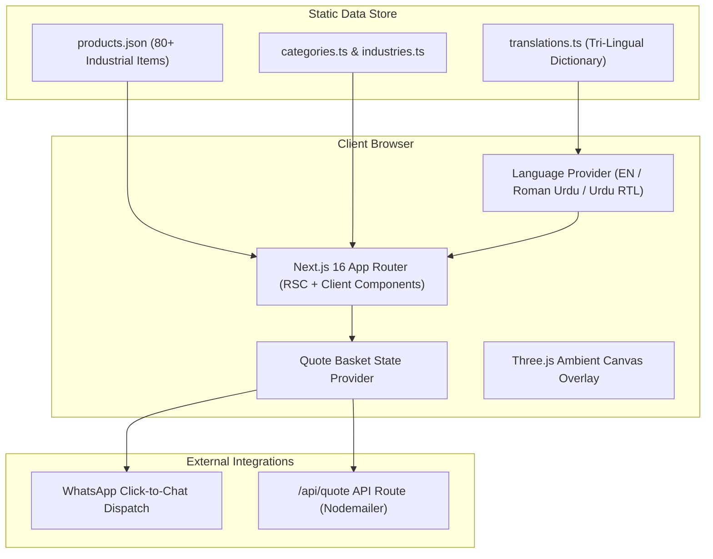

# Al Mobeen Enterprise — Corporate Chemical Catalog Platform

> **Modern, high-performance corporate web platform and interactive chemical catalog for Al Mobeen Enterprise — premier industrial chemical distributor and importer operating from Jodia Bazar, Karachi since 1995.**

---

> **Created & Maintained by [Abdullah Qureshi](https://abdullah-qureshi.vercel.app)**  
> 🌐 **Portfolio**: [abdullah-qureshi.vercel.app](https://abdullah-qureshi.vercel.app) • 💼 **LinkedIn**: [abdullahqureshi27](https://www.linkedin.com/in/abdullahqureshi27) • 🐙 **GitHub**: [@abdullahqureshi27](https://github.com/abdullahqureshi27)

---

[](https://nextjs.org/)
[](https://react.dev/)
[](https://tailwindcss.com/)
[](https://www.typescriptlang.org/)
[](https://threejs.org/)
[](https://github.com/abdullahqureshi27/al-mobeen-enterprise-website)

---

## 🌟 Key Features

- 🎨 **Monochromatic Design System**: Bespoke Oxford Blue & Platinum color palette with smooth, flicker-free Light/Dark Mode theme switching.
- 🌐 **Tri-Lingual Localization**: Native runtime support for **English**, **Roman Urdu**, and **Urdu (RTL with Noto Nastaliq typography)**.
- 🧪 **80+ Chemical Product Catalog**: Categorized catalog covering Solvents, Plasticizers, Pigments, Resins, and Acids with instant client-side filtering, technical specs, and packaging details.
- 📋 **Interactive Quote Basket Drawer**: Client-side persistent inquiry basket allowing B2B buyers to compile products and send requests directly via automated WhatsApp or web email form.
- 🧱 **Accessible Component Architecture**: Built on top of Radix primitives (`@radix-ui/react-slot`), `class-variance-authority`, `clsx`, and `tailwind-merge`.
- ⚡ **Zero-Overhead SSG Prerendering**: Fully pre-rendered static routes for maximum SEO score, core web vitals, and lightning-fast edge delivery.
- 📱 **Adaptive Mobile UI**: Responsive drawer navigation, smooth touch marquee, and Three.js ambient visual effects.

---

## 🏗️ Architecture & Data Flow



---

## 🛠️ Technology Stack

| Domain | Technology / Library | Purpose |
|---|---|---|
| **Core Framework** | [Next.js 16 (App Router)](https://nextjs.org/) | Server Components, routing, SSG prerendering |
| **View Library** | [React 19](https://react.dev/) | Component hierarchy & state management |
| **Language** | [TypeScript 5](https://www.typescriptlang.org/) | End-to-end type safety |
| **Styling** | [Tailwind CSS v4](https://tailwindcss.com/) + CSS Tokens | Responsive styling & theme token engine |
| **Component Primitives** | [Radix UI](https://www.radix-ui.com/) + `cva` | Accessible UI building blocks |
| **Animation & 3D** | [Framer Motion](https://www.framer.com/motion/), [GSAP](https://greensock.com/), [Three.js](https://threejs.org/) | Micro-interactions and interactive 3D elements |
| **Smooth Scrolling** | [Lenis](https://lenis.darkroom.engineering/) | Inertial smooth scroll experience |
| **Notifications** | [Nodemailer](https://nodemailer.com/) | Automated quote dispatch backend |

---

## 🚀 Local Quickstart Guide

### Prerequisites
- Node.js 18.x or higher
- npm 9.x or higher

### 1. Clone & Setup
```bash
git clone https://github.com/abdullahqureshi27/al-mobeen-enterprise-website.git
cd al-mobeen-enterprise-website
npm install
```

### 2. Environment Variables (Optional)
Create a `.env.local` file if you wish to configure mail dispatch:
```env
SMTP_HOST=smtp.gmail.com
SMTP_PORT=587
SMTP_USER=your-email@gmail.com
SMTP_PASS=your-app-password
```

### 3. Run Development Server
```bash
npm run dev
```
Open [http://localhost:3000](http://localhost:3000) in your browser.

---

## 🧪 Testing & Production Build

Verify type definitions, linting, and compile the production bundle:

```bash
# Run ESLint validation
npm run lint

# Compile optimized static production build
npm run build

# Preview production build locally
npm run start
```

---

## 👨‍💻 Author & Connect

**Abdullah Qureshi**  
*Full-Stack & AI Systems Engineer*

- 🌐 **Portfolio**: [https://abdullah-qureshi.vercel.app](https://abdullah-qureshi.vercel.app)
- 💼 **LinkedIn**: [https://www.linkedin.com/in/abdullahqureshi27](https://www.linkedin.com/in/abdullahqureshi27)
- 🐙 **GitHub**: [https://github.com/abdullahqureshi27](https://github.com/abdullahqureshi27)
- ✉️ **Contact**: [mabdullahqureshi583@gmail.com](mailto:mabdullahqureshi583@gmail.com)
